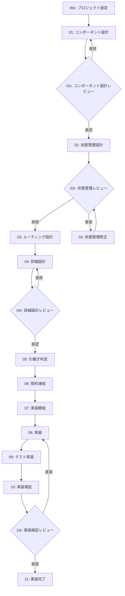

# SPA Contract Framework - 開発フロー

**フレームワーク**: SPA Contract Framework
**バージョン**: 1.0.0
**概要**: SPA開発フレームワーク。コンポーネント設計→状態管理→実装の流れ

---

## ワークフロー概要

---

## フェーズ一覧

| # | フェーズ | 担当 | 成果物 | 推奨ツール |
|---|----------|------|--------|------------|
| 00c | プロジェクト設定 | 設計 | project-config.yml | Claude |
| 01 | コンポーネント設計 | 設計 | コンポーネント仕様書 | Claude |
| 01r | コンポーネント設計レビュー | **人間** | 承認/指摘 | - |
| 02 | 状態管理設計 | 設計 | Store/Context仕様 | Claude |
| 02r | 状態管理レビュー | **人間** | 承認/指摘 | - |
| 03-fix | 状態管理修正 | 設計 | 修正済み仕様 | Claude |
| 03 | ルーティング設計 | 設計 | ルート定義 | Claude |
| 04 | 詳細設計 | 設計 | データフロー、API連携 | Claude |
| 04r | 詳細設計レビュー | **人間** | 承認/指摘 | - |
| 05 | 引継ぎ判定 | 設計 | 判定結果 | Claude |
| 06 | 契約凍結 | 設計 | 凍結宣言 | Claude |
| 07 | 実装開始 | 実装 | 実装計画 | Codex |
| 08 | 実装 | 実装 | コンポーネント、Store | Codex |
| 09 | テスト実装 | 実装 | テストコード | Codex |
| 10 | 実装検証 | 実装 | 検証レポート | Codex |
| 10r | 実装検証レビュー | **人間** | 承認/指摘 | - |
| 11 | 実装完了 | 実装 | 完了報告 | Codex |

---

## ロール定義

### {{DESIGN_ROLE}}（設計担当）

#### 責務
- SPA仕様書（`{{SPA_SPEC_DIR}}/`）の作成・管理
- コンポーネント階層の設計
- 状態管理の設計
- {{IMPL_ROLE}} への仕様説明

#### 権限
- `{{SPA_SPEC_DIR}}/` 配下のファイル作成・編集・削除

#### 禁止事項
- `{{IMPL_DIR}}/` 配下のファイル変更
- `{{TEST_DIR}}/` 配下のファイル変更
- 実装コードの記述

---

### {{IMPL_ROLE}}（実装担当）

#### 責務
- 凍結されたSPA仕様に基づく実装
- テストコードの作成
- 実装上の問題発見時の報告

#### 権限
- `{{IMPL_DIR}}/` 配下のファイル作成・編集・削除
- `{{TEST_DIR}}/` 配下のファイル作成・編集・削除

#### 禁止事項
- `{{SPA_SPEC_DIR}}/` 配下のファイル変更
- SPA仕様の解釈・補完・変更
- 仕様にないコンポーネントの追加

---

## 成果物

### コンポーネント設計フェーズ
- `{{SPA_SPEC_DIR}}/components.yml` - コンポーネント一覧
- `{{SPA_SPEC_DIR}}/components/` - 各コンポーネント仕様

### 状態管理設計フェーズ
- `{{SPA_SPEC_DIR}}/state/store.yml` - Store構造定義
- `{{SPA_SPEC_DIR}}/state/actions.yml` - アクション定義
- `{{SPA_SPEC_DIR}}/state/selectors.yml` - セレクタ定義

### ルーティング設計フェーズ
- `{{SPA_SPEC_DIR}}/routing/routes.yml` - ルート定義
- `{{SPA_SPEC_DIR}}/routing/guards.yml` - ルートガード定義

### 詳細設計フェーズ
- `{{SPA_SPEC_DIR}}/detail/data-flow.yml` - データフロー図
- `{{SPA_SPEC_DIR}}/detail/api-integration.yml` - API連携仕様

### 実装フェーズ
- `{{IMPL_DIR}}/components/` - UIコンポーネント
- `{{IMPL_DIR}}/store/` - 状態管理
- `{{IMPL_DIR}}/routes/` - ルーティング
- `{{TEST_DIR}}/` - テストコード

---

## 改訂履歴

| 日付 | 内容 |
|------|------|
| 2026-02-02 | 初版作成（SPA Contract Frameworkより自動生成） |
